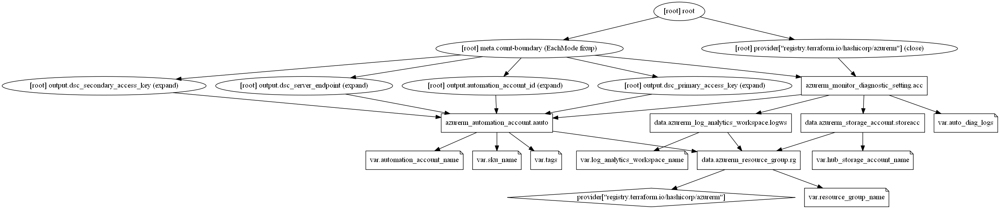

# Automation account Terraform module

Azure Automation is a new service in Azure that allows you to automate Azure management tasks and to orchestrate actions across external systems from right within Azure. It is built on PowerShell Workflow to take advantage of the language’s many features.

## Module Usage

```hcl
module "automation-account" {
  source  = "kumarvna/automation-account/azurerm"
  version = "1.1.0"

  # Resource Group, location, VNet and Subnet details
  resource_group_name     = "rg-shared-westeurope-01"
  automation_account_name = "default-automation-account"

  # (Optional) enabling Azure dignostics
  log_analytics_workspace_name = "loganalytics-we-sharedtest"
  hub_storage_account_name     = "stdiagfortesting"

  # Adding TAG's to your Azure resources (Required)
  tags = {
    ProjectName  = "demo-internal"
    Env          = "dev"
    Owner        = "user@example.com"
    BusinessUnit = "CORP"
    ServiceClass = "Gold"
  }
}
```

## Azure Monitoring Diagnostics

Automation account metrics are collected by default if provided the required log analytics workspace and storage account names, and typically stored in the Azure Monitor metrics database. This module enables to send all the logs and metrics to either storage account, and Log Analytics workspace. To enables this diagnostics provide a valid values to `log_analytics_workspace_name` and `hub_storage_account_name` arguments.

## Requirements

Name | Version
-----|--------
terraform | >= 0.13
azurerm | >= 2.59.0

## Providers

| Name | Version |
|------|---------|
azurerm | >= 2.59.0

## Inputs

Name | Description | Type | Default
---- | ----------- | ---- | -------
`resource_group_name` | The name of the resource group in which resources are created | string | `""`
`log_analytics_workspace_name`|The name of log analytics workspace name|string | `""`
`hub_storage_account_name`|The name of the hub storage account to store logs|string|`""`
`automation_account_name`|Specifies the name of the Automation Account|string|`""`
`sku_name`|The SKU name of the account - only Basic is supported at this time|string|`Basic`
`auto_diag_logs`|A list of categories of platform logs and/or metrics that you want to collect from a resource|string|`["JobLogs", "JobStreams", "DscNodeStatus"]`

## Outputs

|Name | Description|
|---- | -----------|
`automation_account_id`|The Automation Account resource ID
`dsc_server_endpoint`|The DSC Server Endpoint associated with this Automation Account
`dsc_primary_access_key`|The Primary Access Key for the DSC Endpoint associated with this Automation Account
`dsc_secondary_access_key`|The Secondary Access Key for the DSC Endpoint associated with this Automation Account

## Resource Graph



## Authors

Originally created by [Kumaraswamy Vithanala](mailto:kumarvna@gmail.com)

## Other resources

* [Azure Automation Account](https://docs.microsoft.com/en-us/azure/automation/automation-intro)
* [Terraform AzureRM Provider Documentation](https://www.terraform.io/docs/providers/azurerm/index.html)
